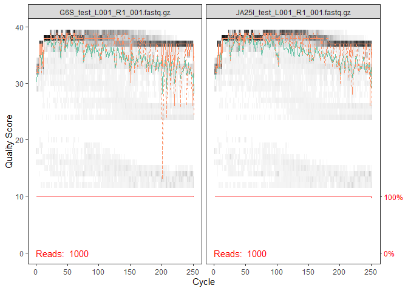
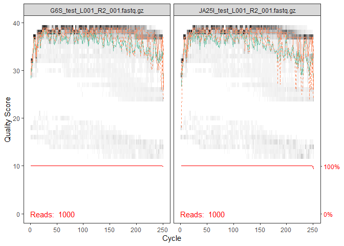
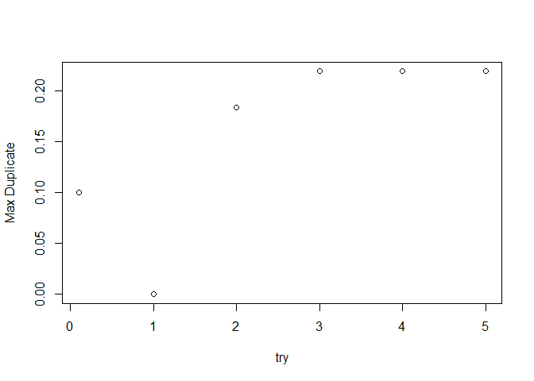
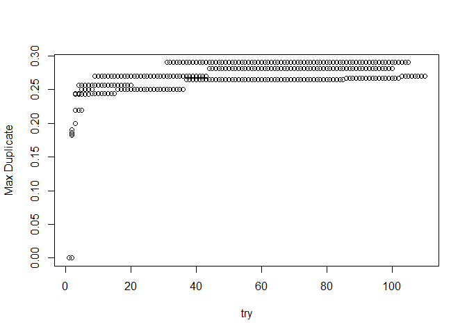
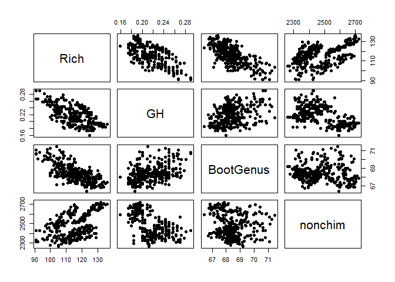
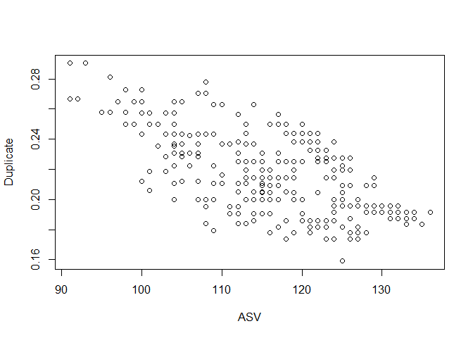
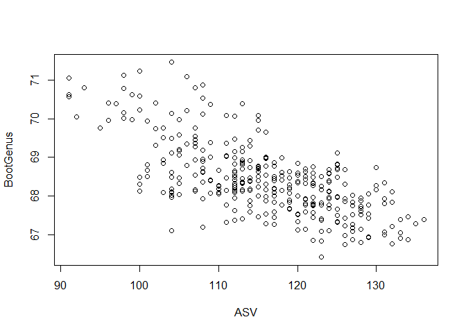
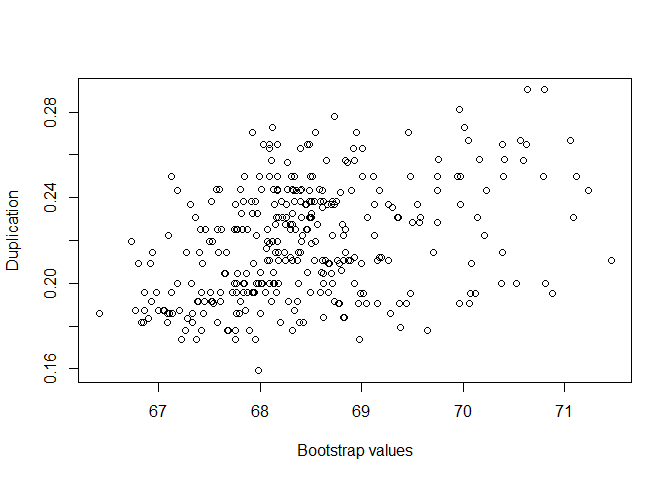
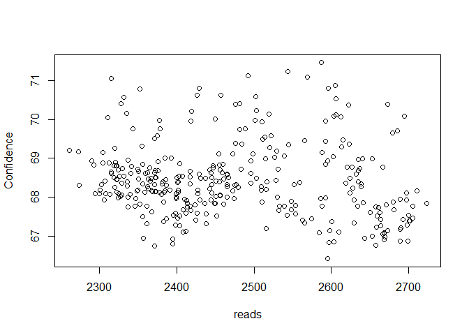

dada2-optimize
================
Michael G. LaMontagne
1/7/2022

## R Markdown

This R Markdown document has scripts that can be used to optimize the
selection of parameters in DADA2. The goal is to select parameters that
maximize the number of ASVs shared between technical replicates and
maximize the confidence of matching reads against reference sequences.

This script requires pairs of fastq files (for and rev) generated from
four samples. It helps these four samples consist of two duplicate
samples. In this demo we run four samples (G6S, JA25I, JA25II, SH13Z).
G6S and SH13Z are a pair of technical replicates and JA25I and JA25II
are a pair.

## Preprocessing. This step runs in a conda environment. Use bioconda to install fastq-tools and then check the installation. This step is run in Linux systems.

``` bash
#conda create --name fastqTools fastq-tools
#conda activate fastqTools
# random reads from a fastq file
#fastq-sample --help
```

## Subsample 1,000 reads from each pair of fastq files following this example. This step is also run in Linux.

``` bash
#fastq-sample G6S_S36_L001_R1_001.fastq G6S_S36_L001_R2_001.fastq -n 1000 #-s 50 -o G6S_test_
```

## Install packages

``` r
library(dada2); packageVersion("dada2")
```

    ## Loading required package: Rcpp

    ## [1] '1.20.0'

``` r
library(philentropy); packageVersion("philentropy")
```

    ## [1] '0.5.0'

``` r
library(DECIPHER); packageVersion("DECIPHER")
```

    ## Loading required package: Biostrings

    ## Loading required package: BiocGenerics

    ## Loading required package: parallel

    ## 
    ## Attaching package: 'BiocGenerics'

    ## The following objects are masked from 'package:parallel':
    ## 
    ##     clusterApply, clusterApplyLB, clusterCall, clusterEvalQ,
    ##     clusterExport, clusterMap, parApply, parCapply, parLapply,
    ##     parLapplyLB, parRapply, parSapply, parSapplyLB

    ## The following objects are masked from 'package:stats':
    ## 
    ##     IQR, mad, sd, var, xtabs

    ## The following objects are masked from 'package:base':
    ## 
    ##     anyDuplicated, append, as.data.frame, basename, cbind, colnames,
    ##     dirname, do.call, duplicated, eval, evalq, Filter, Find, get, grep,
    ##     grepl, intersect, is.unsorted, lapply, Map, mapply, match, mget,
    ##     order, paste, pmax, pmax.int, pmin, pmin.int, Position, rank,
    ##     rbind, Reduce, rownames, sapply, setdiff, sort, table, tapply,
    ##     union, unique, unsplit, which.max, which.min

    ## Loading required package: S4Vectors

    ## Loading required package: stats4

    ## 
    ## Attaching package: 'S4Vectors'

    ## The following objects are masked from 'package:base':
    ## 
    ##     expand.grid, I, unname

    ## Loading required package: IRanges

    ## 
    ## Attaching package: 'IRanges'

    ## The following object is masked from 'package:philentropy':
    ## 
    ##     distance

    ## The following object is masked from 'package:grDevices':
    ## 
    ##     windows

    ## Loading required package: XVector

    ## Loading required package: GenomeInfoDb

    ## 
    ## Attaching package: 'Biostrings'

    ## The following object is masked from 'package:base':
    ## 
    ##     strsplit

    ## Loading required package: RSQLite

    ## [1] '2.20.0'

``` r
head(sessionInfo())
```

    ## $R.version
    ## $R.version$platform
    ## [1] "x86_64-w64-mingw32"
    ## 
    ## $R.version$arch
    ## [1] "x86_64"
    ## 
    ## $R.version$os
    ## [1] "mingw32"
    ## 
    ## $R.version$system
    ## [1] "x86_64, mingw32"
    ## 
    ## $R.version$status
    ## [1] ""
    ## 
    ## $R.version$major
    ## [1] "4"
    ## 
    ## $R.version$minor
    ## [1] "1.1"
    ## 
    ## $R.version$year
    ## [1] "2021"
    ## 
    ## $R.version$month
    ## [1] "08"
    ## 
    ## $R.version$day
    ## [1] "10"
    ## 
    ## $R.version$`svn rev`
    ## [1] "80725"
    ## 
    ## $R.version$language
    ## [1] "R"
    ## 
    ## $R.version$version.string
    ## [1] "R version 4.1.1 (2021-08-10)"
    ## 
    ## $R.version$nickname
    ## [1] "Kick Things"
    ## 
    ## 
    ## $platform
    ## [1] "x86_64-w64-mingw32/x64 (64-bit)"
    ## 
    ## $locale
    ## [1] "LC_COLLATE=English_United States.1252;LC_CTYPE=English_United States.1252;LC_MONETARY=English_United States.1252;LC_NUMERIC=C;LC_TIME=English_United States.1252"
    ## 
    ## $running
    ## [1] "Windows 10 x64 (build 22000)"
    ## 
    ## $RNGkind
    ## [1] "Mersenne-Twister" "Inversion"        "Rejection"       
    ## 
    ## $basePkgs
    ## [1] "stats4"    "parallel"  "stats"     "graphics"  "grDevices" "utils"    
    ## [7] "datasets"  "methods"   "base"

## Create blank variables

``` r
# 
x <- c(0.1:0.5)
D <- matrix(x, nrow=18, ncol=1)
trackRun <- matrix(x, nrow=6, ncol=1)
rownames(D) <- c("try", "t1", "t2", "t3", "Rich", "G12", "H12", "GH", "NoChim", "M12", "BootClass", "BootGenus", "input", "filtered", "denoisedF", "denoisedR", "merged", "nonchim" )
# reset counters
try <- c(0)
M12 <- c(0)
D
```

    ##           [,1]
    ## try        0.1
    ## t1         0.1
    ## t2         0.1
    ## t3         0.1
    ## Rich       0.1
    ## G12        0.1
    ## H12        0.1
    ## GH         0.1
    ## NoChim     0.1
    ## M12        0.1
    ## BootClass  0.1
    ## BootGenus  0.1
    ## input      0.1
    ## filtered   0.1
    ## denoisedF  0.1
    ## denoisedR  0.1
    ## merged     0.1
    ## nonchim    0.1

## Create path to folder with four fastq pairs

``` r
path <- "C:/Users/mglam/Dropbox/BIOINFO/Rscripts/HHdada/UNTreads/UNTtest" 
# CHANGE ME to the directory containing the fastq files after unzipping.
list.files(path)
```

    ## [1] "filtered"                         "G6S_test_L001_R1_001.fastq.gz"   
    ## [3] "G6S_test_L001_R2_001.fastq.gz"    "JA25I_test_L001_R1_001.fastq.gz" 
    ## [5] "JA25I_test_L001_R2_001.fastq.gz"  "JA25II_test_L001_R1_001.fastq.gz"
    ## [7] "JA25II_test_L001_R2_001.fastq.gz" "SH13Z_test_L001_R1_001.fastq.gz" 
    ## [9] "SH13Z_test_L001_R2_001.fastq.gz"

## Forward and reverse fastq filenames must have format: SAMPLENAME\_R1\_001.fastq and SAMPLENAME\_R2\_001.fastq

``` r
fnFs <- sort(list.files(path, pattern="_R1_001.fastq.gz", full.names = TRUE))
fnRs <- sort(list.files(path, pattern="_R2_001.fastq.gz", full.names = TRUE))
# Extract sample names, assuming filenames have format: SAMPLENAME_XXX.fastq
sample.names <- sapply(strsplit(basename(fnFs), "_"), `[`, 1)
## plot some quality profiles from forward
plotQualityProfile(fnFs[1:2])
```

    ## Warning: `guides(<scale> = FALSE)` is deprecated. Please use `guides(<scale> =
    ## "none")` instead.

<!-- -->

``` r
## and reverse
plotQualityProfile(fnRs[1:2])
```

    ## Warning: `guides(<scale> = FALSE)` is deprecated. Please use `guides(<scale> =
    ## "none")` instead.

<!-- -->

## Place filtered files in filtered/ subdirectory

``` r
filtFs <- file.path(path, "filtered", paste0(sample.names, "_F_filt.fastq.gz"))
filtRs <- file.path(path, "filtered", paste0(sample.names, "_R_filt.fastq.gz"))
head(filtFs)
```

    ## [1] "C:/Users/mglam/Dropbox/BIOINFO/Rscripts/HHdada/UNTreads/UNTtest/filtered/G6S_F_filt.fastq.gz"   
    ## [2] "C:/Users/mglam/Dropbox/BIOINFO/Rscripts/HHdada/UNTreads/UNTtest/filtered/JA25I_F_filt.fastq.gz" 
    ## [3] "C:/Users/mglam/Dropbox/BIOINFO/Rscripts/HHdada/UNTreads/UNTtest/filtered/JA25II_F_filt.fastq.gz"
    ## [4] "C:/Users/mglam/Dropbox/BIOINFO/Rscripts/HHdada/UNTreads/UNTtest/filtered/SH13Z_F_filt.fastq.gz"

## Select range of parameters based on inspection of above quality plots and run optimization loop. Users should increase number in “(length(D) &gt; 100).” Also, if not run on Windows, set multithread to TRUE.

``` r
repeat{
t1 <- (sample(180:240, 1))
t2 <- (sample(140:200, 1))
t3 <- (sample(16:20, 1))
## count trys
try <- try +1
## standard filtering 
# On Windows set multithread=FALSE
out <- filterAndTrim(fnFs, filtFs, fnRs, filtRs, trimLeft=t3, truncLen=c(t1,t2),
                     maxN=0, maxEE=c(2,2), truncQ=2, rm.phix=TRUE,
                     compress=TRUE, multithread=FALSE) 
head(out)
## learn error rates
errR <- learnErrors(filtRs, randomize = TRUE, multithread=FALSE, nbases = 1e8)
errF <- learnErrors(filtFs, randomize = TRUE, multithread=FALSE, nbases = 1e8)
plotErrors(errF, nominalQ=TRUE)
## dereplication
derepFs <- derepFastq(filtFs, verbose=TRUE)
derepRs <- derepFastq(filtRs, verbose=TRUE)
## Name the derep-class objects by the sample names
names(derepFs) <- sample.names
names(derepRs) <- sample.names
## run the core sample inference program
dadaFs <- dada(derepFs, err=errF, multithread=FALSE)
dadaRs <- dada(derepRs, err=errR, multithread=FALSE)
## insepct one
dadaFs[[1]]
## merge paired reads
mergers <- mergePairs(dadaFs, derepFs, dadaRs, derepRs, verbose=TRUE)
# Inspect the merger data.frame from the first sample
head(mergers[[1]])
## construct amplicon sequence variant table (ASV), an OTU table
seqtab <- makeSequenceTable(mergers)
dim(seqtab)
## inspect distribution of sequence lengths
table(nchar(getSequences(seqtab)))
## remove non-target lengths 
#seqtab2 <- seqtab[,nchar(colnames(seqtab)) %in% seq(250,254)]
## table(nchar(getSequences(seqtab2)))
## identify chimers
seqtab.nochim <- removeBimeraDenovo(seqtab, method="consensus", multithread=FALSE, verbose=TRUE)
dim(seqtab.nochim)
## define function getN
getN <- function(x) sum(getUniques(x))
## track reads through pipeline
track <- cbind(out, sapply(dadaFs, getN), sapply(dadaRs, getN), sapply(mergers, getN), rowSums(seqtab.nochim))
# If processing a single sample, remove the sapply calls: e.g. replace sapply(dadaFs, getN) with getN(dadaFs)
colnames(track) <- c("input", "filtered", "denoisedF", "denoisedR", "merged", "nonchim")
rownames(track) <- sample.names
## see how much data you have left
head(track)
trackRun <- as.matrix(colSums(track))
## calculate Jaccard coefficients
Rich <- ncol(seqtab.nochim)
N <- seqtab.nochim
N[N>0] <- 1
N[is.na(N)] <- 0
k <- philentropy::distance(N, method = "jaccard")
# write.csv(k, "k.csv", row.names = rownames(N))
G12 <- 1-k[1,4]
H12 <- 1-k[2,3]
GH <- mean(G12, H12)
NoChim <- sum(seqtab.nochim)/sum(seqtab)
## download taxonmy
dna <- DNAStringSet(getSequences(seqtab.nochim)) # Create a DNAStringSet from the ASVs
load("C:/Users/mglam/Dropbox/BIOINFO/Rscripts/SILVA_SSU_r138_2019.RData") # CHANGE TO THE PATH OF YOUR TRAINING SET
# Match reads against reference sequencies
ids <- IdTaxa(dna, trainingSet, strand="top", processors=NULL, verbose=TRUE, threshold = 0) # use all processors
ranks <- c("domain", "phylum", "class", "order", "family", "genus", "species") # ranks of interest
# Convert the output object of class "Taxa" to a matrix analogous to the output from assignTaxonomy
taxid <- t(sapply(ids, function(x) {
  m <- match(ranks, x$rank)
  taxa <- x$taxon[m]
  taxa[startsWith(taxa, "unclassified_")] <- NA
  taxa
}))
colnames(taxid) <- ranks; rownames(taxid) <- getSequences(seqtab.nochim)
# Extract matrix of confidence intervals 
output <- t(sapply(ids, function(x) {
  m <- match(ranks, x$rank)
  confd <- x$confidence[m]
  confd
}))
# Calculate average bootstrap value for domain - class
BootClass <- sum(output[,1:3], na.rm=TRUE)/(3*Rich) 
BootGenus <- sum(output[,1:6], na.rm=TRUE)/(6*Rich) 
## name each data value
SNRalgn <- c(try, t1, t2, t3, Rich, G12, H12, GH, NoChim, M12, BootClass, BootGenus)
names(SNRalgn) <- c("try", "t1", "t2", "t3", "Rich", "G12", "H12", "Rep", "NoChim", "M12", "BootClass", "BootGenus")
B = matrix(SNRalgn, nrow=12, ncol=1) 
# add number of reads at processing
E <- rbind(B,trackRun)
D <- cbind(E, D)
rownames(D) <- c("try", "t1", "t2", "t3", "Rich", "G12", "H12", "GH", "NoChim", "M12", "BootClass", "BootGenus", "input", "filtered", "denoisedF", "denoisedR", "merged", "nonchim" )
M12 <- max(D[8,])
#saveRDS(D, "dadaD2optmz.rds")
# plot.default(D[1,], D[10,], xlab = "Try", ylab = "Duplicate")
if (length(D) > 100) {break}
}
```

    ## 538050 total bases in 3587 reads from 4 samples will be used for learning the error rates.
    ## 789140 total bases in 3587 reads from 4 samples will be used for learning the error rates.
    ## Sample 1 - 903 reads in 542 unique sequences.
    ## Sample 2 - 913 reads in 552 unique sequences.
    ## Sample 3 - 908 reads in 508 unique sequences.
    ## Sample 4 - 863 reads in 541 unique sequences.
    ## Sample 1 - 903 reads in 403 unique sequences.
    ## Sample 2 - 913 reads in 452 unique sequences.
    ## Sample 3 - 908 reads in 446 unique sequences.
    ## Sample 4 - 863 reads in 496 unique sequences.
    ## ================================================================================
    ## 
    ## Time difference of 16.78 secs
    ## 
    ## 539320 total bases in 3880 reads from 4 samples will be used for learning the error rates.
    ## 636320 total bases in 3880 reads from 4 samples will be used for learning the error rates.
    ## Sample 1 - 963 reads in 532 unique sequences.
    ## Sample 2 - 976 reads in 527 unique sequences.
    ## Sample 3 - 971 reads in 491 unique sequences.
    ## Sample 4 - 970 reads in 566 unique sequences.
    ## Sample 1 - 963 reads in 393 unique sequences.
    ## Sample 2 - 976 reads in 473 unique sequences.
    ## Sample 3 - 971 reads in 475 unique sequences.
    ## Sample 4 - 970 reads in 530 unique sequences.
    ## ================================================================================
    ## 
    ## Time difference of 16.75 secs
    ## 
    ## 553680 total bases in 3845 reads from 4 samples will be used for learning the error rates.
    ## 669030 total bases in 3845 reads from 4 samples will be used for learning the error rates.
    ## Sample 1 - 957 reads in 535 unique sequences.
    ## Sample 2 - 968 reads in 530 unique sequences.
    ## Sample 3 - 963 reads in 495 unique sequences.
    ## Sample 4 - 957 reads in 561 unique sequences.
    ## Sample 1 - 957 reads in 428 unique sequences.
    ## Sample 2 - 968 reads in 485 unique sequences.
    ## Sample 3 - 963 reads in 487 unique sequences.
    ## Sample 4 - 957 reads in 557 unique sequences.
    ## ================================================================================
    ## 
    ## Time difference of 17.27 secs
    ## 
    ## 639000 total bases in 3550 reads from 4 samples will be used for learning the error rates.
    ## 795200 total bases in 3550 reads from 4 samples will be used for learning the error rates.
    ## Sample 1 - 895 reads in 536 unique sequences.
    ## Sample 2 - 905 reads in 550 unique sequences.
    ## Sample 3 - 903 reads in 506 unique sequences.
    ## Sample 4 - 847 reads in 531 unique sequences.
    ## Sample 1 - 895 reads in 437 unique sequences.
    ## Sample 2 - 905 reads in 496 unique sequences.
    ## Sample 3 - 903 reads in 480 unique sequences.
    ## Sample 4 - 847 reads in 519 unique sequences.
    ## ================================================================================
    ## 
    ## Time difference of 17.52 secs
    ## 
    ## 544288 total bases in 3728 reads from 4 samples will be used for learning the error rates.
    ## 745600 total bases in 3728 reads from 4 samples will be used for learning the error rates.
    ## Sample 1 - 931 reads in 542 unique sequences.
    ## Sample 2 - 941 reads in 551 unique sequences.
    ## Sample 3 - 942 reads in 516 unique sequences.
    ## Sample 4 - 914 reads in 568 unique sequences.
    ## Sample 1 - 931 reads in 419 unique sequences.
    ## Sample 2 - 941 reads in 476 unique sequences.
    ## Sample 3 - 942 reads in 474 unique sequences.
    ## Sample 4 - 914 reads in 530 unique sequences.
    ## ================================================================================
    ## 
    ## Time difference of 15.75 secs

## Plot progress and import file with larger number of iterations

``` r
Dd <- as.data.frame(t(D))
plot.default(Dd$try, Dd$M12, xlab = "try", ylab = "Max Duplicate")
```

<!-- -->

## Export data to data frame and plot results

``` r
Dc <- readRDS("De.rds")
De <- rbind(Dd, Dc)
De <- De[ which(De$Rich > 10),]
plot.default(De$try, De$M12, xlab = "try", ylab = "Max Duplicate")
```

<!-- -->

## Plot pairs

``` r
n <- c(5,8,12,18)
pairs(De[,n], pch = 19)
```

<!-- --> \#\# Plot number of ASVs versus
duplication rate

``` r
plot.default(De$Rich, De$GH, xlab = "ASV", ylab = "Duplicate")
```

<!-- --> \#\# Plot number of ASVs versus
duplication rate

``` r
plot.default(De$Rich, De$BootGenus, xlab = "ASV", ylab = "BootGenus")
```

<!-- --> \#\# Plot duplication versus
match to confidence of assignment to genus

``` r
plot.default(De$BootGenus, De$GH, xlab = "Bootstrap values", ylab = "Duplication")
```

<!-- -->

## Export data to data frame and plot results

``` r
write.csv(as.matrix(t(De)), "De.csv")
plot.default(De$nonchim, De$BootGenus, xlab = "reads", ylab = "Confidence")
```

<!-- --> \#\# Select parameters

``` r
DeFit <- De[ which(De$Rich > 100),] # set ASV mininum
DeFit <- DeFit[order(-DeFit$GH, -DeFit$BootGenus),] # sort by fit
t1 <- DeFit$t1[1]
t2 <- DeFit$t2[1]
t3 <- DeFit$t3[1]
write.csv(as.matrix(t(DeFit)), "dadaFit.csv")
tDF <- c(DeFit$t3[1], DeFit$t1[1], DeFit$t2[1])
names(tDF) <- c("trimLeft", "truncateLeft", "truncateRight")
tDF = as.matrix(tDF, nrow=3, ncol=1) 
colnames(tDF) <- c("parameter")
tDF
```

    ##               parameter
    ## trimLeft             18
    ## truncateLeft        220
    ## truncateRight       162

End
